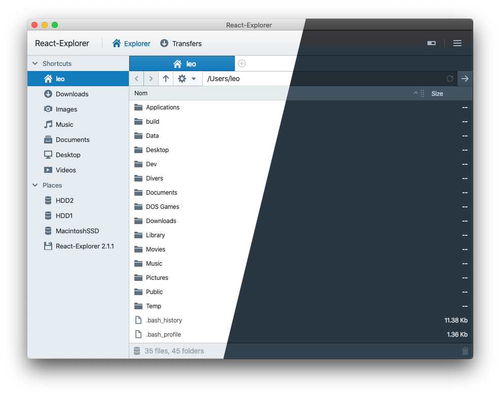
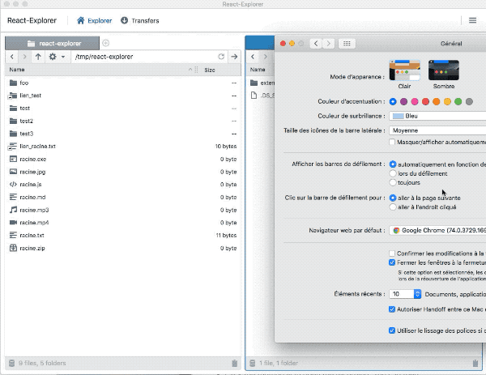
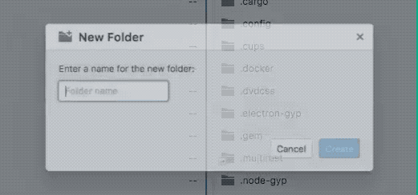
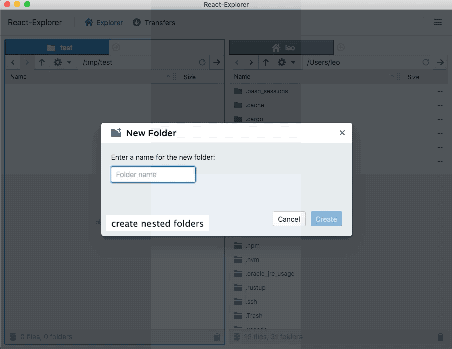
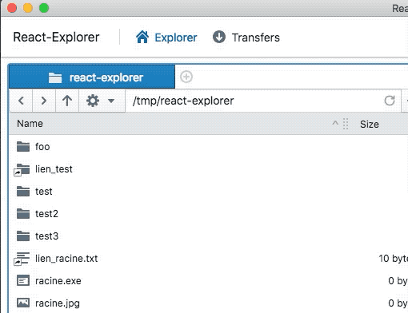

# File manager written in TypeScript & React

[](https://www.travis-ci.org/warpdesign/react-explorer)



## Features

- Dual-view window
- Tabs support
- Fully keyboard controlled
- Fully localized (French & English available)
- Dark Mode with automatic detection (macOS Mojave)
- Open a terminal from any folder
- Plugin-based: local supported for now, ftp in the works

## Feature tour

### Dark theme automatic detection (macOS Mojave)

React-Explorer will automatically switch to dark-theme when it's detected:



### Create and read folder

By pressing `ctrl` (Linux/Win) or `cmd` the folder you create will be automatically read:



### Create nested folders

You can create several folders at once by separating them with a forward-slash:



### Quick access to parent folders

By right-clicking on a tab's icon you can quickly get access to the parents of the currend folder:



## Requirements

React-Explorer works on any modern Windows, Mac or Linux computer.

## Building for local development

In order to build React-Explorer you need to have installed `nodejs`.

Once installed, building React-Explorer is as easy as typing:

```shell
npm install && npm run build
```

This will build a development package.

In order to run in locally without having to create a native executable, you can then type:

```shell
npx electron ./build/main.js
```

## Building binary packages

In order to build binary packages, simply type the following:

```shell
npm run dist
```

This will build packaged binaries of React Explorer into the `dist` folder for every supported platform.

React-Explorer can also be built for a single patform. For example, to build only the Windows binaries, type:

```shell
npm run dist-win
```

## Localization

React-Explorer is fully localized using `.json` files. Right now, English and French are available.

Adding a new language to React-Explorer is easy: simply duplicate one of the file found in [src/locale/lang](https://github.com/warpdesign/react-explorer/tree/master/src/locale/lang) directory.

The new file should have the name `code.json` where code is a valid language code, for example: `ja.json` to add support for Japanese.

## Tests

### Unit testing

React-Explorer has both unit tests (using Jest) and end to end tests (using Cypress).

To run unit tests simply type:

```shell
npm test
```

This will start Jest and run every spec files found in src. Every test file can be found next to the component it is testing.

### End to End testing

End to end tests are using Cypress and are in the separate `e2e` directory.

Since end to end tests need to run Electron-Explorer outside of Electron, a special build needs to be created that stubs some Electron APIs. To create this build, simply type:

```shell
npm run build:e2e
```

This will create a new Electron-Explorer in the `build-e2e` directory.

For React-Explorer to run without Electron, a local webserver needs to be started before running the tests:

```shell
npm run server
```

Then type `cd e2e && npm install` to install Cypress dependencies (this only needs to be run once).

Now, simply type:

```shell
npm run cypress
```

This brings up the cypress interface from where you can run end to end tests.

## How to develop a new Plugin

React-Explorer has been written so that it can easily be extended using plugins.

As a starting point you may use the `FsGeneric` skeleton.

## Acknowledgments

React-Explorer makes use of the following tools/components:

- [React](https://reactjs.org)
- [Electron](https://electron.s.org)
- [TypeScript](https://typescriptlang.org)
- [MobX](https://mobx.js.org)
- [Blueprintjs](https://blueprintjs.com)
- [basic-ftp](https://github.com/patrickjuchli/basic-ftp)
- [i18next](https://i18next.com) & [react-i18n](https://github.com/i18next/react-i18next)

## Licence

React-Explorer is licenced under the MIT licence.
